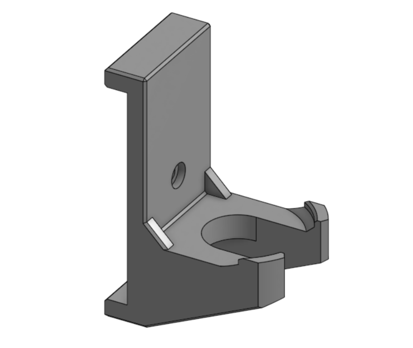
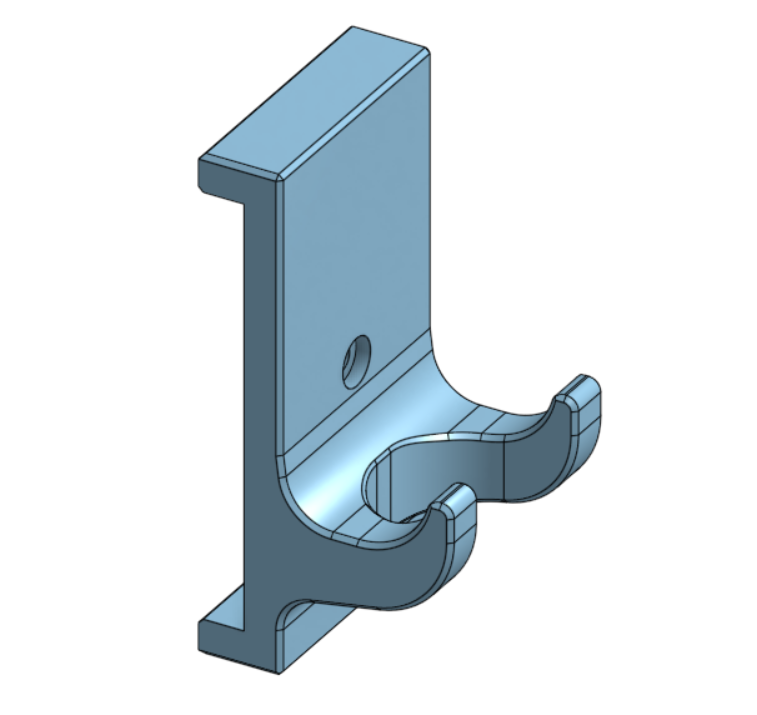

A collection of 3D printed mounts and hangers for garage tools designed to mount to a horizontal 1x4 or 2x4 board.

## Installing notes
There is a lot of variability of boards dimensions so the mounts might not fit snug on some. 

To help with this, don't use countersink screws, they'll lift the mount away from the board. Also press the mount downward while tightening the screw. Purposely angling the screw against the bottom of the hole helps as well. 

## Base template dimensions
Thickness: .3"
Overhand: .375"
Opening 3.51"

---

## Circular Tool Mount

Description placeholder — describe the part here.

[Download STL](stl/circular_tool_mount.stl)

---

## Universal Hook

Description placeholder — describe the part here.

[Download STL](stl/universal_hook.stl)